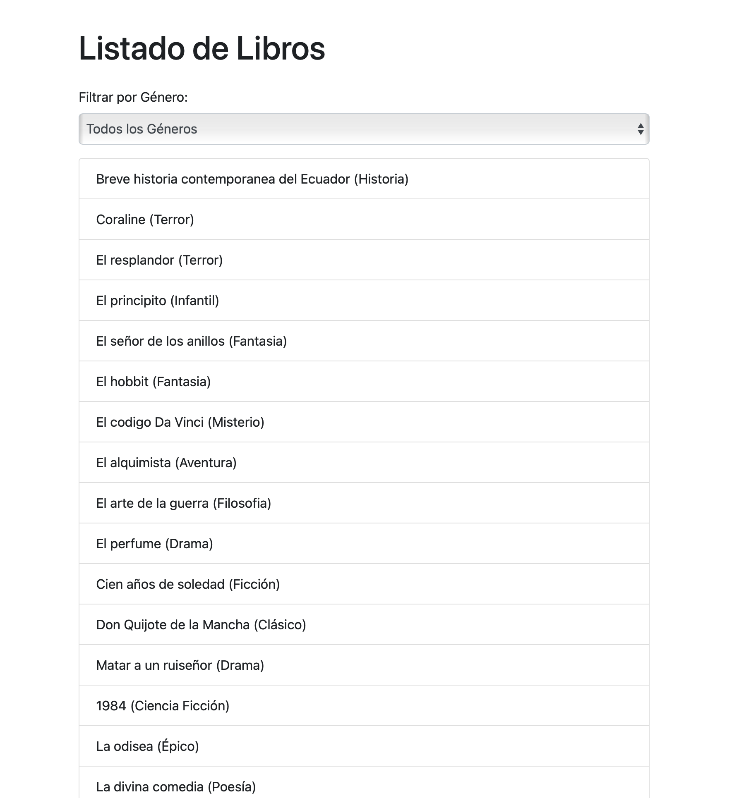
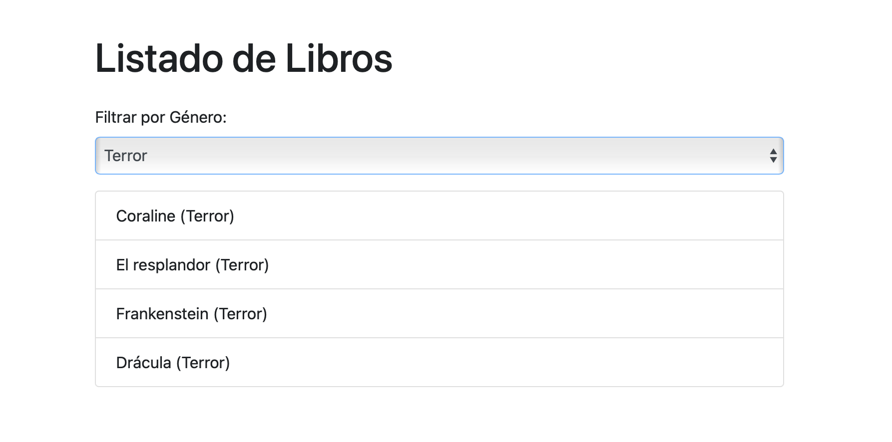

### Pasos para ejecutar el proyecto

## Requisitos

- Tener instalado Docker
- Tener instalado Node.js
- Tener instalado Visual Studio Code
- Tener la extension de Visual Studio Code "Live Server"
- Tener instalado npm

## Configuracion de base de datos

- Crear una base de datos en SQL Server

```bash
docker run -e "ACCEPT_EULA=Y" -e "MSSQL_SA_PASSWORD=ClaveS1gur@321"  -p 1433:1433 --name sqlalgoritmos —hostname sqlalgoritmos -d mcr.microsoft.com/mssql/server:2022-latest
```

- Ingresamos a un dbms
- Copiamos el script "basededatos.sql"
- Ejecutamos el script

## Configuracion de la aplicacion

- Clonar el repositorio
- Ingresar a la carpeta del proyecto
- Instalar las dependencias

```bash
npm install
```

- Iniciar la aplicacion

```bash
node server.js
```

- En VSC abrir el archivo "index.html"
- Click derecho en el archivo "index.html" y seleccionar "Open with Live Server"

## Resultado

#### Listado de libros



#### Libros filtrados por categoria


